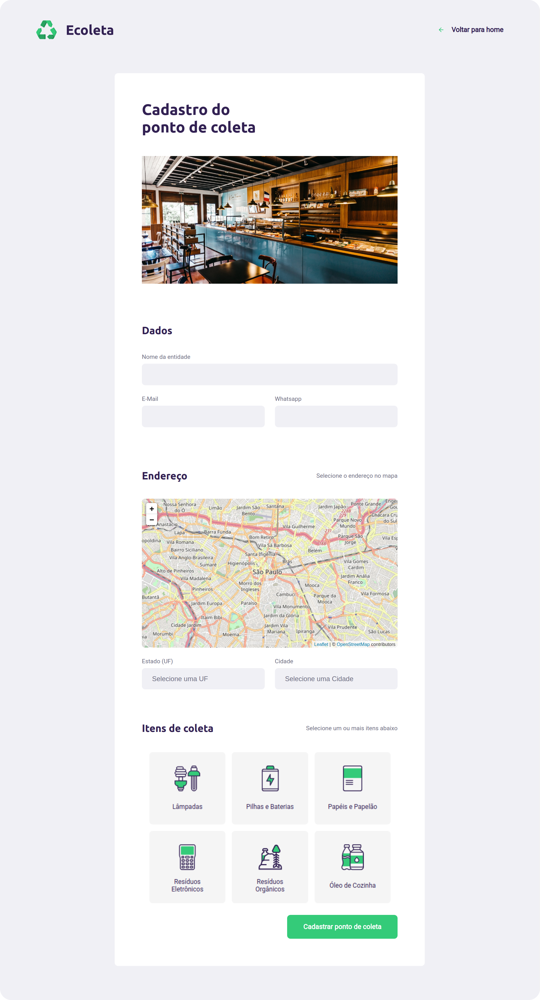
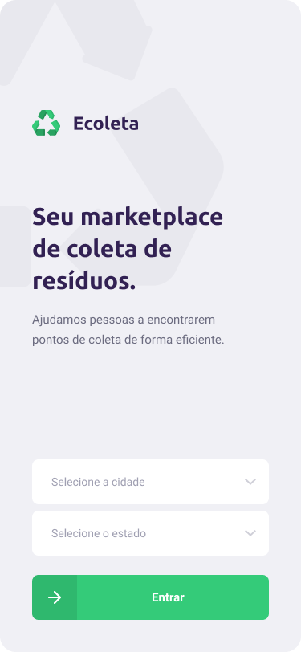
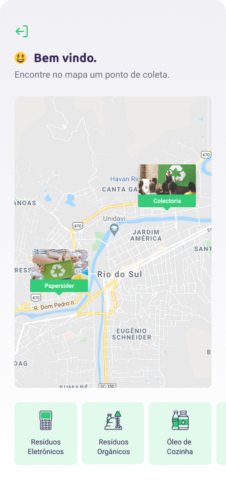
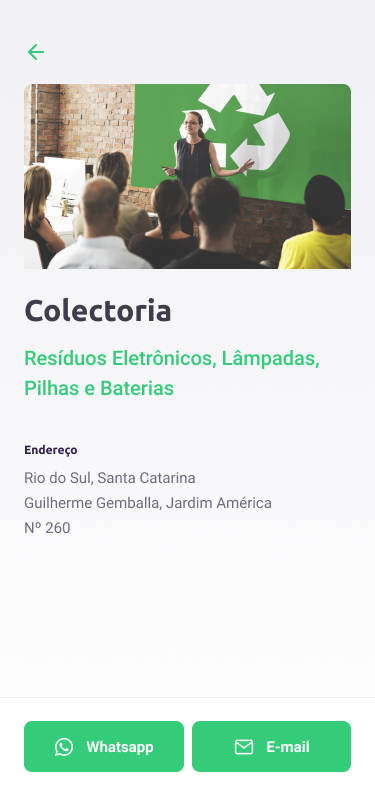

<br />

<p align="center">
  
</p>

<h1 align="center" style="text-align: center;">Ecoleta</h1>

<p align="center">
	<a href="https://github.com/LuizFerK">
		
	</a>
	<a href="#">
		
	</a>
	<a href="hhttps://github.com/LuizFerK/Ecoleta/stargazers">
		
	</a>
	<a href="https://github.com/LuizFerK/Ecoleta/network/members">
		
	</a>
	<a href="https://github.com/LuizFerK/Ecoleta/graphs/contributors">
		
	</a>
</p>

<p align="center">
	<b>Help people find collect points to deposit their wastes!</b><br />
	<span>Created with Node.js, ReactJS and React Native, all with Typescript.</span><br />
	<sub>Made with ❤️</sub>
</p>

<br />

<p align="center">
  
  
  
  
  
</p>

<br />

> # :warning: Note
> This project was made in 2020 with portfolio and study purposes and is no longer in maintenance. The code is under the [MIT license](https://github.com/LuizFerK/GoRestaurant/blob/master/LICENSE), so feel free to clone it and use it the way you want but keep in mind that you probably will need to update some dependencies.
<br />

# :pushpin: Contents

- [Features](#rocket-features)
- [Installation](#wrench-installation)
- [Getting started](#bulb-getting-started)
- [Techs](#fire-techs)
- [Issues](#bug-issues)
- [License](#book-license)

# :rocket: Features

### Web

- Create points

### Mobile

- See all points on the map
- Filter the points by category
- See the point details

# :wrench: Installation

### Required :warning:
- Node.js
- Postgres database
- Yarn

### SSH

SSH URLs provide access to a Git repository via SSH, a secure protocol. If you have an SSH key registered in your GitHub account, clone the project using this command:

```git clone git@github.com:LuizFerK/Ecoleta.git```

### HTTPS

In case you don't have an SSH key on your GitHub account, you can clone the project using the HTTPS URL, run this command:

```git clone https://github.com/LuizFerK/Ecoleta.git```

**Both of these commands will generate a folder called Ecoleta, with all the project**

# :bulb: Getting started

### Server

1. Open the **server** folder and run ```yarn``` to install the dependencies
3. Rename the ```ormconfig.example.json``` to ```ormconfig.json``` and add your postgres **port**, **user** and **password** in the archive
4. Create a database named ```ecoleta``` on your postgres
5. Run ```yarn typeorm migration:run``` to run the migrations to your database
6. Run ```yarn seed:run``` to run the seeds to your database
7. If all goes well, run ```yarn dev:server``` to open the development server on port 3333

### Web

1. Open the **web** folder and run ```yarn``` to install the dependencies
2. Run ```yarn start``` to open the web application on port 3000. (the app will open in your browser automatically)


### Mobile

1. Open the **mobile** folder and run ```yarn``` to install the dependencies
2. In ```src/services/api.ts``` change the baseURL for your IPv4 address: ```baseURL: 'http://YOUR-IPV4-ADDRESS:3333'```
3. Download the [Expo Go](https://expo.io/client) app on iOS or Android
4. Run ```yarn start``` to open the expo metro-bundler
5. Scan the QR Code or connect your Expo account on the Expo Go app to open your app
> You'll need to change manually the start point of your map on the `Point` page

> If you don't create any point, nothing will appear on your map

# :fire: Techs

### Typescript (language)

### Node.js (server)
- Celebrate
- CORS
- Express
- TypeORM

### ReactJS (web)
- Axios
- Leaflet (Maps)
- Styled Components

### React Native (mobile)
- Axios
- React Native Maps
- React Navigation
- Styled Components

# :bug: Issues

Find a bug or error on the project? Please, feel free to send me the issue on the [Ecoleta issues area](https://github.com/LuizFerK/Ecoleta/issues), with a title and a description of your found!

If you know the origin of the error and know how to resolve it, please, send me a pull request, I will love to review it!

# :book: License

Released in 2020.

This project is under the [MIT license](https://github.com/LuizFerK/Ecoleta/blob/master/LICENSE).

<p align="center">
	< keep coding /> :rocket: :heart:
</p>
