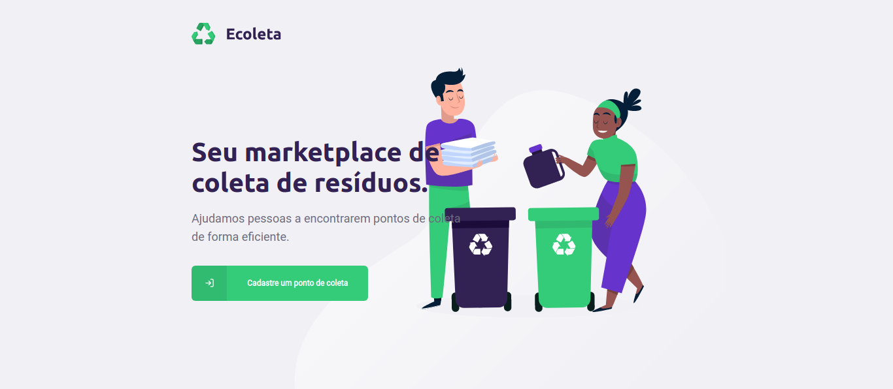
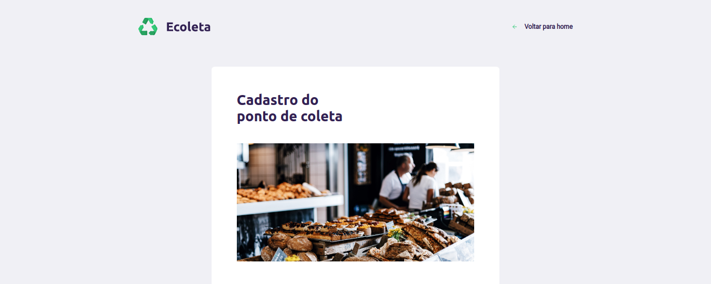
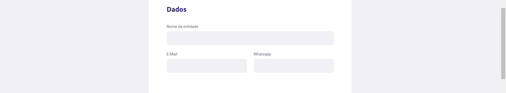
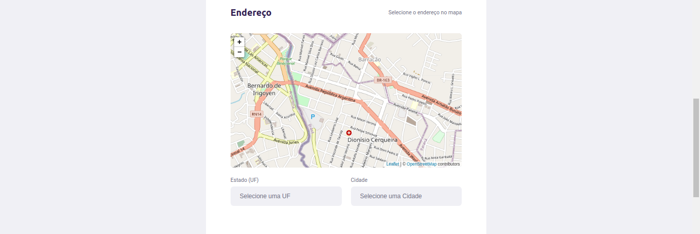
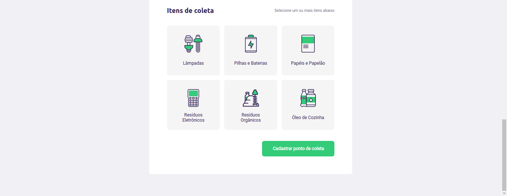

<h1 align="center">
  Ecoleta
  <hr />
  
  
  
  
  
  <hr />
	
</h1>
<p align="center">
	The application has been created to help people find collect points to deposit their wastes. Created with Node.js ReactJS and React Native, all with Typescript.
</p>
<h1>Technologies used in this application:<h2>

### Node.js (backend)
- Express
- CORS
- Celebrate
- TypeORM
### React.js (WebClient)
- Axios
- Styled Components
- Leaflet (Maps)
### React Native (MobileClient)
- Axios
- Styled Components
- React Navigation
- React Native Maps

<h1>Get started</h1>

### !!! Requirements
- Node
- Yarn
- Postgres database

To start the aplications in your device, first, clone this repository in a new folder. After that, with your terminal, open the folders ```backend```, ```frontend``` and ```mobile``` and run ```yarn``` in each one. After the dependeces instalation, run ```yarn dev:server``` on ```backend``` folder and ```yarn start``` on ```frontend``` folder. To open the project on your device, run ```yarn start``` on ```mobile``` folder, and open the project with the Expo app.

A new tab will be open in your browser with the application (frontend).

The app will load in your mobile device (mobile)...
